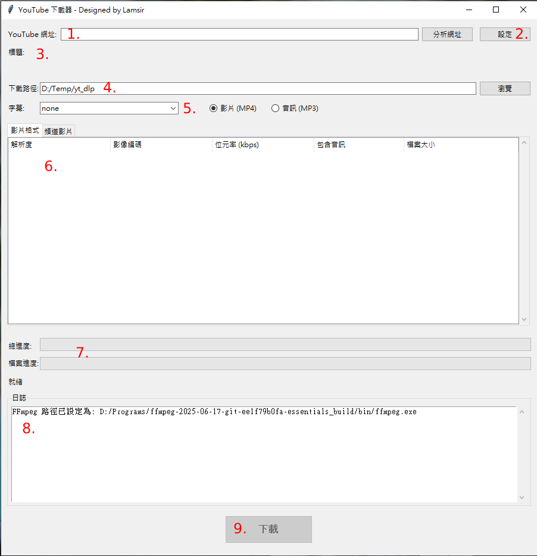

# YouTube 下載器

youtube_downloader_gui.py 提供一個圖形化介面，讓使用者可以輕鬆下載 YouTube 上的單一影片、播放列表或整個頻道的影片。它基於強大的 `yt-dlp` 函式庫，並透過 FFmpeg 提供格式合併與轉換功能。

---

## 1. 執行環境

* **作業系統**:
    * Windows 10 / 11
    * macOS
    * Linux
    (本程式為跨平台設計，在主流作業系統上均可執行)

* **Python 版本**:
    * 建議使用 Python 3.8 或更高版本。

---

## 2. 安裝步驟

在執行此程式前，您需要安裝幾個必要的 Python 套件。請開啟您的終端機 (Terminal) 或命令提示字元 (Command Prompt)，並執行以下指令：

```bash
pip install yt-dlp requests pillow
```

-   `yt-dlp`: 核心的 YouTube 下載函式庫。
-   `requests`: 用於從網路下載圖片（影片縮圖）。
-   `Pillow`: 用於處理與顯示圖片。

---

## 3. 首次執行設定 (非常重要)

**FFmpeg 是本程式的關鍵元件**，它用於合併高畫質影片的影像和聲音，以及將音訊轉換為 MP3 格式。您必須手動下載它。

1.  **下載 FFmpeg**:
    * 請至 FFmpeg 官方網站 ([ffmpeg.org](https://ffmpeg.org)) 的下載區。
    * Windows 使用者可以從 [gyan.dev](https://www.gyan.dev/ffmpeg/builds/) 或 [BtbN](https://github.com/BtbN/FFmpeg-Builds/releases) 找到已編譯好的版本。下載後解壓縮，您會找到 `bin` 資料夾，裡面的 `ffmpeg.exe` 就是我們需要的檔案。

2.  **設定 FFmpeg 路徑**:
    * 首次啟動程式後，點擊右上角的「**設定**」按鈕。
    * 在「FFmpeg 目錄」欄位旁，點擊「瀏覽」。
    * 找到您剛剛解壓縮後得到的 `ffmpeg.exe` 檔案並選取它。
    * 同時，您也可以設定一個方便您管理的「預設下載路徑」。
    * 點擊「確定」儲存設定。

**完成此設定後，程式才具備完整功能。**

---

## 4. 介面說明



1.  **YouTube 網址**:
    * 在此處貼上您想下載的影片、播放列表或頻道的網址。
    * **分析網址**: 點擊此按鈕開始分析貼上的網址。

2.  **設定按鈕**:
    * 開啟設定視窗，可設定 FFmpeg 路徑、預設下載路徑及下載重試次數等。

3.  **影片資訊區**:
    * **標題**: 分析成功後，會在此顯示影片或播放列表的標題。
    * **縮圖**: 顯示影片、播放列表或頻道的縮圖。

4.  **下載路徑**:
    * 設定本次下載任務的儲存位置。程式會自動填入您在「設定」中指定的預設路徑。您可以點擊「瀏覽」臨時更改。

5.  **下載選項**:
    * **字幕**: 如果影片提供字幕，您可以在此下拉選單中選擇要下載的字幕語言（目前僅篩選英文與中文手動字幕）。
    * **下載類型**:
        * **影片 (MP4)**: 下載影像檔。
        * **音訊 (MP3)**: 只下載聲音，並自動轉換為 MP3 格式。

6.  **內容分頁**:
    * **影片格式 (單一影片)**: 當分析單一影片網址時，此分頁會列出所有可用的影片畫質。您必須在此選擇一個格式才能下載。
        * `解析度`: 影片的尺寸。
        * `影像編碼`: 如 h264, vp9, av1 等。
        * `包含音訊`: 標示「否」的通常是高畫質影像軌，程式在下載時會**自動**尋找最佳音訊軌並使用 FFmpeg 進行合併。
    * **頻道影片 (播放列表/頻道)**: 當分析播放列表或頻道網址時，此分頁會列出所有影片。
        * 使用每行開頭的「☐」複選框來勾選您想下載的影片。
        * 可使用「全選」和「取消全選」按鈕快速操作。

7.  **進度與狀態**:
    * **總進度**: 在下載多個檔案時，顯示整體任務的完成百分比。
    * **檔案進度**: 顯示目前正在下載的單一檔案的進度。
    * **狀態列**: 顯示目前程式的狀態，如「就緒」、「分析中」、「正在下載...」等。

8.  **日誌 (Log)**:
    * 這是一個非常重要的區域，它會顯示程式詳細的執行記錄，包括分析過程、下載活動、合併資訊、錯誤訊息等。當程式看起來沒有反應時，請先查看此處的訊息。

9.  **下載按鈕**:
    * 完成所有設定與選擇後，點擊這個又大又粗的按鈕開始下載任務！

---

## 5. 注意事項

* **尊重版權**: 請僅使用本工具下載您有權觀看與持有的內容。請遵守您所在地區的版權與智慧財產權法規。
* **頻道分析時間**: 分析含有數百甚至數千部影片的頻道需要較長時間。程式已優化為掃描最穩定的「上傳列表」，並會透過日誌顯示掃描進度，請耐心等候，程式並未凍結。
* **檔案命名**: 下載的影片會自動以「`畫質p - 影片標題.mp4`」的格式命名（例如 `1080p - 我的貓咪影片.mp4`），方便您整理與識別。
* **網路連線**: 下載速度與穩定性取決於您的網路狀況。若下載失敗，程式會根據您的設定進行重試。
