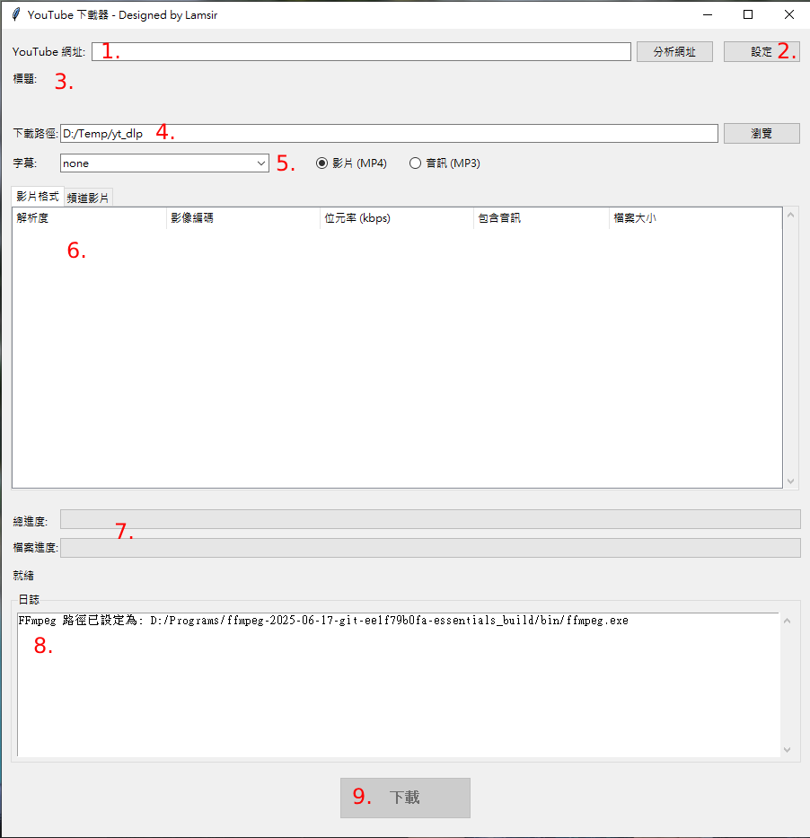

# YouTube 下載器

> **版本**: v2.0 | **開發者**: Lamsir

基於 `yt-dlp` + `FFmpeg` 的圖形化 YouTube 下載工具，採用模組化架構，支援單一影片、播放清單與整個頻道的批次下載。

---

## 目錄

- [1. 核心功能](#1-核心功能)
- [2. 執行環境需求](#2-執行環境需求)
- [3. 快速開始](#3-快速開始)
- [4. 專案結構](#4-專案結構)
- [5. 介面說明](#5-介面說明)
- [6. 設定選項](#6-設定選項)
- [7. 常見問題](#7-常見問題)
- [8. 注意事項](#8-注意事項)

---

## 1. 核心功能

| 功能 | 說明 |
|------|------|
| **單一影片下載** | 支援 MP4 影片（含多解析度/編碼選擇）與 MP3 音訊（192 kbps） |
| **播放清單批次下載** | 自動掃描播放清單內所有影片，勾選後批次下載 |
| **頻道影片掃描** | 支援 `@handle`、`/channel/`、`/c/`、`/user/` 四種頻道網址格式 |
| **並行批次下載** | 可設定 1~4 個同時下載數，大幅縮短多影片下載時間 |
| **字幕嵌入** | 支援下載手動字幕（中/英文），嵌入影片 |
| **縮圖預覽** | 分析網址後自動顯示影片 / 頻道縮圖 |
| **自動重試** | 下載失敗時依設定自動重試（可調次數與延遲） |
| **下載歷史記錄** | SQLite 持久化儲存，含統計面板，支援查詢與清除 |
| **環境設定精靈** | 首次啟動自動檢測 Python / Node.js / FFmpeg，逐步引導安裝 |
| **yt-dlp 自動更新** | 啟動時自動檢查並升級 yt-dlp 至最新版 |
| **跨平台** | 支援 Windows 10/11、macOS、Linux |

---

## 2. 執行環境需求

### 2.1 必要依賴

| 依賴 | 最低版本 | 用途 |
|------|---------|------|
| **Python** | 3.11+ | 程式執行語言 |
| **Node.js** | 18+（LTS） | yt-dlp 新版依賴（部分 extractor 需要 JavaScript 執行環境） |
| **FFmpeg** | 任意版本 | 影音合併（高畫質影片）、MP3 轉檔 |

### 2.2 作業系統

- Windows 10 / 11
- macOS（Apple Silicon / Intel）
- Linux（Debian / Ubuntu / Fedora / Arch）

> 本程式為純 Python + tkinter 實作，所有主流桌面作業系統均可執行。

---

## 3. 快速開始

### 3.1 安裝 Python 依賴

```bash
# 複製或下載此專案後，進入專案目錄：
cd youtube_downloader

# 安裝 Python 套件：
pip install -r requirements.txt
```

`requirements.txt` 包含以下依賴：

| 套件 | 版本 | 用途 |
|------|------|------|
| `yt-dlp` | ≥ 2024.1.1 | YouTube 解析與下載核心 |
| `Pillow` | ≥ 10.0.0 | 縮圖載入與顯示 |
| `requests` | ≥ 2.28.0 | 網路圖片下載 |

### 3.2 安裝 Node.js（如尚未安裝）

yt-dlp 新版需要 Node.js 作為 JavaScript 執行環境。請前往 [nodejs.org](https://nodejs.org/) 下載 LTS 版本（≥ 18）並安裝。

### 3.3 安裝 FFmpeg

**Windows**：
1. 前往 [gyan.dev](https://www.gyan.dev/ffmpeg/builds/) 下載 `ffmpeg-release-full.7z`
2. 解壓縮到 `C:\ffmpeg`
3. 將 `C:\ffmpeg\bin` 加入系統 PATH，或在程式「設定」中手動指定 `ffmpeg.exe` 路徑

**macOS**：
```bash
brew install ffmpeg
```

**Linux**：
```bash
# Debian / Ubuntu
sudo apt install ffmpeg

# Fedora
sudo dnf install ffmpeg
```

### 3.4 啟動程式

```bash
python main.py
```

首次啟動時，程式會自動執行**環境設定精靈**，檢測 Python / Node.js / FFmpeg 的安裝狀態。若有缺失，精靈會提供逐步安裝指引與官方下載連結。

---

## 4. 專案結構

```
youtube_downloader/
├── main.py                     # 程式入口（~80 行）—— 啟動檢測、精靈、主視窗
├── requirements.txt            # Python 依賴聲明
├── yd_settings.json            # 使用者設定（JSON，執行時自動產生）
├── yd_history.db               # 下載歷史記錄（SQLite，執行時自動產生）
├── yd_log.txt                  # 執行日誌
├── app/
│   ├── __init__.py             # 套件初始化（v2.0.0）
│   ├── gui.py                  # 使用者介面（tkinter/ttk）
│   ├── downloader.py           # 下載引擎（yt-dlp 封裝、並行下載）
│   ├── config.py               # 設定檔管理（JSON 讀寫）
│   ├── history.py              # 歷史記錄（SQLite CRUD + 統計）
│   ├── utils.py                # 通用工具（YtdlpLogger、編碼簡化）
│   ├── setup_checker.py        # 環境依賴檢測（Python/Node.js/FFmpeg）
│   └── setup_wizard.py         # 引導精靈（逐步安裝 UI）
├── docs/
│   └── 使用者初次安裝引導計劃書.md  # 設計文件
└── youtube_downloader_gui.py   # 舊版單一檔案（保留備份 .bak）
```

### 架構設計原則

| 原則 | 說明 |
|------|------|
| **關注點分離** | UI / 下載引擎 / 設定 / 歷史 / 工具各自獨立模組 |
| **佇列通訊** | 背景執行緒透過 `queue.Queue()` 與主執行緒通訊，避免 UI 凍結 |
| **執行緒安全** | SQLite 使用 WAL 模式，每個執行緒獨立連線 |
| **純邏輯模組** | `config.py`、`history.py`、`setup_checker.py` 無 UI 依賴，可獨立測試 |

---

## 5. 介面說明

### 5.1 主視窗佈局




### 5.2 各區塊功能

1.  **YouTube 網址**:
    * 在此處貼上您想下載的影片、播放列表或頻道的網址。
    * **分析網址**: 點擊此按鈕開始分析貼上的網址。

2.  **設定按鈕**:
    * 開啟設定視窗，可設定 FFmpeg 路徑、預設下載路徑及下載重試次數等。

3.  **影片資訊區**:
    * **標題**: 分析成功後，會在此顯示影片或播放列表的標題。
    * **縮圖**: 顯示影片、播放列表或頻道的縮圖。

4.  **下載路徑**:
    * 設定本次下載任務的儲存位置。程式會自動填入您在「設定」中指定的預設路徑。您可以點擊「瀏覽」臨時更改。

5.  **下載選項**:
    * **字幕**: 如果影片提供字幕，您可以在此下拉選單中選擇要下載的字幕語言（目前僅篩選英文與中文手動字幕）。
    * **下載類型**:
        * **影片 (MP4)**: 下載影像檔。
        * **音訊 (MP3)**: 只下載聲音，並自動轉換為 MP3 格式。

6.  **內容分頁**:
    * **影片格式 (單一影片)**: 當分析單一影片網址時，此分頁會列出所有可用的影片畫質。您必須在此選擇一個格式才能下載。
        * `解析度`: 影片的尺寸。
        * `影像編碼`: 如 h264, vp9, av1 等。
        * `包含音訊`: 標示「否」的通常是高畫質影像軌，程式在下載時會**自動**尋找最佳音訊軌並使用 FFmpeg 進行合併。
    * **頻道影片 (播放列表/頻道)**: 當分析播放列表或頻道網址時，此分頁會列出所有影片。
        * 使用每行開頭的「☐」複選框來勾選您想下載的影片。
        * 可使用「全選」和「取消全選」按鈕快速操作。

7.  **進度與狀態**:
    * **總進度**: 在下載多個檔案時，顯示整體任務的完成百分比。
    * **檔案進度**: 顯示目前正在下載的單一檔案的進度。
    * **狀態列**: 顯示目前程式的狀態，如「就緒」、「分析中」、「正在下載...」等。

8.  **日誌 (Log)**:
    * 這是一個非常重要的區域，它會顯示程式詳細的執行記錄，包括分析過程、下載活動、合併資訊、錯誤訊息等。當程式看起來沒有反應時，請先查看此處的訊息。

9.  **下載按鈕**:
    * 完成所有設定與選擇後，點擊這個又大又粗的按鈕開始下載任務！


### 5.3 內容分頁詳解

| 分頁 | 顯示時機 | 內容 |
|------|---------|------|
| **影片格式** 　| 分析單一影片 | 列出所有可用解析度、影像編碼（h264/vp9/av1）、是否含音訊；選取後下載 |
| **頻道影片** 　| 分析頻道或播放清單　 | 影片列表 + ☐ 複選框；支援「全選 / 取消全選」；勾選後批次下載 |
| **下載歷史** 　| 隨時可用 | 顯示過往下載記錄（網址、標題、格式、狀態、時間）；含成功/失敗統計；支援重新整理與清除歷史 |

---


## 6. 設定選項

| 設定項目 | 預設值 | 說明 |
|----------|--------|------|
| **FFmpeg 路徑** | （空白） | `ffmpeg.exe` 的完整路徑；也可加入系統 PATH 後自動偵測 |
| **預設下載路徑** | 程式所在目錄 | 每次下載的預設儲存位置，可於主畫面臨時更改 |
| **下載失敗重試次數** | 2 | 單一影片下載失敗後的重試次數（0~3） |
| **重試等待秒數** | 5 | 每次重試之間的等待秒數（1~10） |
| **同時下載數量** | 2 | 批次下載時的並行數量（1 = 序列下載，2~4 = 並行下載） |

設定儲存於 `yd_settings.json`，啟動時自動載入。

---

## 7. 常見問題

### Q: 為什麼需要 Node.js？
**A:** yt-dlp 自 2024 年起部分 extractor 需要使用 JavaScript 執行環境來解析 YouTube 的 bot 防護機制。Node.js 是官方推薦的執行環境。若未安裝，部分影片可能無法解析。

### Q: 「分析網址」後一直沒有反應？
**A:** 請查看下方的日誌區域。頻道掃描（尤其影片數量多時）需要較長時間，程式並未凍結，日誌會即時顯示掃描進度。

### Q: 下載的高畫質影片沒有聲音？
**A:** 這是正常現象。YouTube 將高畫質影像與音訊分開儲存。本程式會自動下載最佳音訊軌，並透過 FFmpeg 合併。若 FFmpeg 未正確設定，合併會失敗。請確認「設定」中的 FFmpeg 路徑正確。

### Q: 如何下載整個頻道的所有影片？
**A:** 貼上頻道網址（如 `https://www.youtube.com/@頻道名稱`），點擊「分析網址」，在「頻道影片」分頁中使用「全選」→「開始下載」即可。

### Q: 下載的檔案存放在哪裡？
**A:** 預設存放在程式所在目錄。可在「設定」中修改預設下載路徑，或在主畫面每次下載前臨時更改。

### Q: 如何查看之前的下載記錄？
**A:** 點擊「下載歷史」分頁即可查看所有過往下載記錄，包含成功/失敗統計。可點擊「清除歷史」刪除所有記錄。

---

## 8. 注意事項

- **尊重版權**：請僅下載您有權觀看與持有的內容，遵守所在地區的版權法規。
- **網路環境**：下載速度取決於您的網路狀況。
- **檔案命名**：下載的影片自動以 `解析度p - 影片標題.mp4` 格式命名（例如 `1080p - 我的影片.mp4`）。
- **日誌檔案**：`yd_log.txt` 會自動輪轉，超過 5 MB 時清空重建。
- **yt-dlp 更新**：程式啟動時會自動檢查 yt-dlp 更新。若自動更新失敗，可手動執行 `pip install --upgrade yt-dlp`。

---

> Built with ❤️ by Lamsir · Powered by [yt-dlp](https://github.com/yt-dlp/yt-dlp) + [FFmpeg](https://ffmpeg.org) + [nodejs.org](https://nodejs.org/) 
